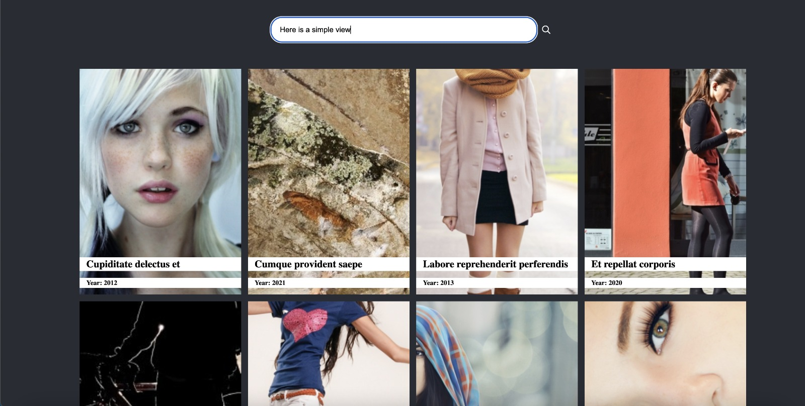

# Movie explorer 🎥

## Summary

This project is a Movie Catalog Explorer 🎬 :)

## Preview

## How to

- Run development

-- yarn start 

- Run Production

-- yarn build 

- Testing

yarn test:coverage

### Test options

yarn test - just run test with coverage console

yarn test:update - update snapshots

yarn test:coverage - run test and generate the file aboce on coverage folder

# Tools

- React
- Typescript
- Jest
- Webpack 5
- Babel
- React Testing Library
- Styled Components
- Material UI - MUI
- MirageJS - Mock Server
- React Query - Caching and Fetch State Management
- Axios - Fetch Library

# Task requirements

The main requirements are:

- The user should be able to search for movies
- The user should be able to paginate the catalog
- We expect you to use React and TypeScript

### What are we evaluating:

- Your `React` skills
- Your `TypeScript` skills
- Your `css` skills (use Styled-components is a plus)

## Server-side api

This project provides a server-side nodejs API that contains the endpoint to retrieve the list of 1000 movies. 

To start the service API, you need to run:

    yarn start

and use the url: `http://localhost:8080/api/movies` to request the movie list.

## Additional information

The server API is built on top of the https://github.com/typicode/json-server library. This library offers many features like filtering, sorting and paging.

Good luck!